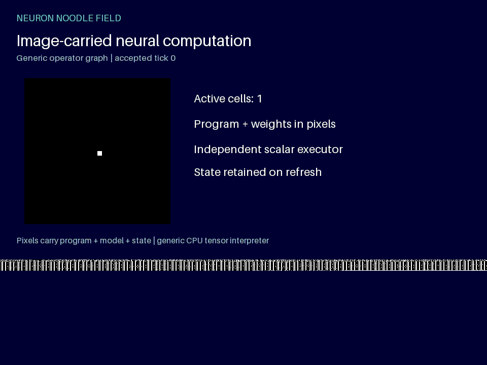

# Neuron Noodle Field

**Version 0.3.0 · Python 3.12+ · GPL-3.0-only**

An executable neural operator graph, its model, and its current field state are stored in TIFF/GIF pixels. A bounded generic interpreter reads those pixels and runs the carried instructions. Refreshed output images contain the new state, so executing them again advances the computation.



The image supplies the neighborhood offsets, weights, bias, arithmetic, activation, threshold, and starting state. Changing the carried model or program changes the result without editing the interpreter. Training is only an example-preparation step; executing a carrier does not retrain or select a fixed host OR routine.

Computation still requires the Python/NumPy CPU interpreter in this repository. The generic interpreter's implementation is external to the image; its executable operator graph is in the image. An ordinary image viewer only displays the animation. This is not a physical optical computer or a full Penteract release qualification.

## Run it

```bash
python -m venv .venv
# Activate the environment using your shell's usual command.
python -m pip install -r requirements.txt
python run.py
```

The default command prepares an image containing a trained local OR model, its operator graph, a 32 × 32 state with one active center cell, and twelve requested steps. It then executes that image into `runs/demo/`. Output folders must be new; existing runs are preserved.

```bash
# Inspect the code, model and state recovered from pixels.
python run.py inspect demo/input.tiff

# Re-run the initial twelve-step image program.
python run.py run demo/input.tiff --output runs/replay

# Advance the state carried by a refreshed output image by one step.
python run.py run demo/processing.gif --output runs/next
python run.py run runs/next/processing.tiff --output runs/next-again

# Continue the included midpoint checkpoint, including its saved program.
python run.py resume demo/checkpoint --steps 6 --output runs/resumed
```

The pinned tested stack is NumPy 2.3.5 and Pillow 12.3.0. Install with `python -m pip install .` to also get the `neuron-noodle-field` command.

## Proof that the image controls execution

These three examples use the same starting state and the same interpreter. Both TIFF and GIF versions are included and executed in the recorded checks:

| Image program | What changed in the pixels | Active cells after one step | After refreshing once |
| --- | --- | ---: | ---: |
| `examples/or.tiff` / `.gif` | Baseline learned model and five-neighbor graph | 5 | 13 |
| `examples/and.tiff` / `.gif` | Only the weights and bias | 0 | 0 |
| `examples/center.tiff` / `.gif` | Only the graph's GATHER offsets | 1 | 1 |

```bash
python run.py run examples/or.gif --output runs/or
python run.py run examples/and.gif --output runs/and
python run.py run examples/center.gif --output runs/center
```

[Behavior evidence](examples/behavior_evidence.json) records the image, model, program, and unchanged interpreter hashes. Reproduce the authored variants in a new folder with `python prepare_examples.py --output runs/variants`.

## The image language

The bounded `nnf-image/1` payload contains `program`, `model`, `state`, `tick`, and `steps`. The program has at most 32 instructions and sixteen registers. Its generic primitives are:

| Instruction | Meaning |
| --- | --- |
| `STATE dst` | Load the image-carried binary field |
| `PARAM dst key` | Load carried model weights or bias |
| `CONST dst number` | Load a finite numeric constant |
| `GATHER dst src offsets` | Sample carried offsets with zero padding |
| `DOT dst features weights` | Compute a feature-weight dot product |
| `ADD` / `MUL dst a b` | Scalar or shape-matched tensor arithmetic |
| `SIGMOID dst src` | Bounded logistic activation |
| `GE dst a b` | Elementwise threshold comparison |
| `RETURN state probabilities` | Return a binary grid and probability grid |

The default image spells out this graph: load state → gather five offsets → dot product → add bias → sigmoid → compare with 0.5 → return. The interpreter contains no named OR/AND/center rule opcode. A second implementation evaluates the same graph with Python lists and scalar math; its output must agree with the NumPy execution before the state is accepted.

Author other supported programs through `make_image_job`, `encode_payload`, and `save_carriers` in `neural_field.py`. `prepare_image_job` trains the default example before encoding it. Its training function is not called when an existing image executes.

## Output and checkpoints

`processing.tiff` and `processing.gif` carry the final accepted state, the same program/model, and a one-step refresh request. Every animation frame contains that same current payload; the visual frames show the run's history. `input.tiff`, `.gif`, or `.png` retains the exact input bytes.

`field_states.tiff` contains all accepted grids. `receipt.json` contains relative source paths, parameters, program/model hashes, state roots, scalar-reference checks, and artifact hashes. `checkpoint/` stores the midpoint state, model, program, and integrity manifest. A checkpoint can resume without retraining.

`accepted_pixel160.bin` uses a local 160-bit cell format: five big-endian 32-bit lanes containing float32 probability bits, accepted bit, tick, cell type `1`, and reserved `0`. Coordinates remain in `coordinates.json`. The persisted computational field is the binary grid; diagnostic probabilities are recalculated during execution. This local format is not a claim of universal Pixel160 compatibility.

`evidence.mssl` is a sealed MSSL version 0.3 `module`/`learn` evidence record. It identifies host CPU execution and explicitly disclaims native MSSL computation. No MSSL/LCTL runtime, OCR engine, Java runtime, or external corpus is redistributed.

## Bounds and integrity

Fields are 8–64 cells per side, with 1–24 steps per invocation. Programs have at most 32 instructions, model vectors at most nine finite weights, and GATHER offsets at most two cells in each direction. Intermediate values, shapes, and tick counts are bounded. Images must be 960 × 720 TIFF/GIF/PNG files, at most 32 MiB and 32 frames; canonical payloads are at most 16 KiB.

Every frame's exact black/white payload cells, length, SHA256, JSON structure, graph, model and state are checked. Checkpoints validate bounded files, hashes, model/program structure, dimensions and exact binary pixels. Failed runs do not publish partial output or replace existing runs. Published output directories inherit normal user permissions on Windows.

Hashes detect changes; they do not authenticate an author. Validly re-encoded programs are intentionally allowed to behave differently. Image programs cannot request Python evaluation, imports, shell commands, filesystem access, or network actions. Floating-point bytes can vary across numerical platforms; the independent scalar comparison uses a stated `1e-12` tolerance and requires exact binary-state agreement.

## Test and audit

```bash
python -m unittest discover -s tests -v
```

The 21 tests include all 32 neighborhoods for both OR and AND models, changed-model and changed-program execution through TIFF and GIF, refreshed-carrier continuation, no runtime retraining, a one-weight graph, an independent Manhattan-distance oracle, checkpoint-program integrity, malformed and excessive inputs, and source preservation. See [audit.json](audit.json) and [CHANGELOG.md](CHANGELOG.md).

## License

Project source, tests, documentation, and generated examples are licensed under **GNU General Public License version 3 only (GPL-3.0-only)**. See [LICENSE](LICENSE). Installed dependencies retain their respective licenses.
