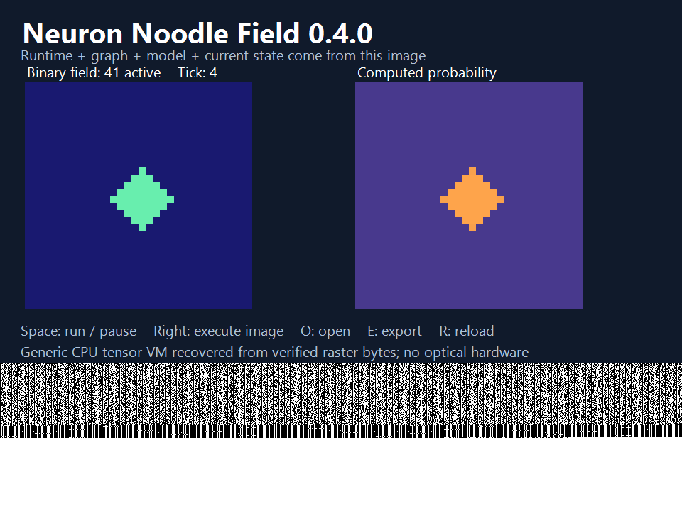

# Neuron Noodle Field

**Version 0.4.0 · Windows desktop player · GPL-3.0-only**

The **interpreter module, executable neural graph, model and current field state are stored in TIFF/GIF pixels**. The desktop player reads the image, verifies its approved interpreter, executes its carried graph, and writes the next state into a new image.

## Download and run

Download **Neuron-Noodle-0.4.0-win-x64.zip** from the [v0.4.0 release](https://github.com/LKVexa/neuron-noodle-field/releases/tag/v0.4.0). Extract the whole ZIP, then double-click **Play.cmd** or **NeuralPlayer.exe**. Keep the extracted files together. The package includes the required .NET runtime; no Python, SDK, administrator access or command prompt is needed.

The GitHub **Source code** ZIP is for development. The named Windows ZIP is the ready-to-run application.

| Control | Action |
| --- | --- |
| Execute image / Right arrow | Run the step count carried by the current image |
| Run / pause / Space | Advance automatically, then pause |
| Open image / O | Load another model/program or an exported continuation |
| Reload / R | Return to the opened image's original state |
| Export TIFF + GIF / E | Save the current program, runtime, model and state to new files |

Open `examples/and.tiff` or `examples/center.gif` in the downloaded package to compare behavior. Each starts with one seed. OR spreads it, AND extinguishes it, and CENTER holds it in place. The difference is in the image's weights or graph, not a selected host routine.



## What executes

Each native image contains compressed bytes of the compiled `NeuralRuntime` assembly, the generic operator graph, model weights/bias, binary field, tick and requested steps. The C# bootstrap requires a build-time approved assembly hash, recovers the module from pixels and loads it in memory. There is no adjacent `NeuralRuntime.dll` fallback. The interpreter implements **STATE, PARAM, CONST, GATHER, DOT, ADD, MUL, SIGMOID, GE and RETURN**; it has no named OR, AND or CENTER routine.

The .NET CLR, operating system, image codecs, user interface and renderer remain outside the image. They provide the bootstrap that reads and runs the embedded interpreter. Computation uses a CPU. An ordinary image viewer only displays the image; there is no physical optical computing claim or full Penteract qualification.

Model numbers and numeric constants use bounded decimal strings in the native packet, avoiding cross-language differences in JSON float formatting. The interpreter converts them to finite float64 values. Grid coordinates, registers, ticks and binary state remain JSON integers. Native payloads use `NNFIELD3`, `nnf-native/1` and `nnf-graph/2`.

The player checks a **pinned approved runtime hash** before loading a module. A self-consistent checksum on another assembly does not authorize it. Image graphs cannot request files, network access, imports, shell commands or arbitrary code. SHA256 packet checks detect damage; they are not author signatures.

## Verified behavior

| Image-only change | Active cells after one execution | After reopening the export |
| --- | ---: | ---: |
| OR graph and model | 5 | 13 |
| AND weights/bias | 0 | 0 |
| CENTER GATHER offsets | 1 | 1 |

Both TIFF and GIF are tested. Independent NumPy and scalar Python interpreters verify exact binary-state equality and probability agreement at `rtol=atol=1e-12`. Native tests include all 32 local binary neighborhoods, random finite models, a generic arithmetic graph, multiple requested steps, unknown opcodes, invalid registers, nonfinite models, overflow, corrupt cells, conflicting frames and source preservation.

The packaged EXE was tested with `PATH` restricted to Windows System32. It executed without Python, authoring sidecars or a loose interpreter DLL. Its live window test exercised keyboard handlers, three timer updates, TIFF/GIF export callbacks and continuation from both exports. See [audit.json](audit.json) and [native release evidence](evidence/native-release.json). A passing smoke test does not replace testing on every Windows configuration; policy-denied execution is reported, not bypassed.

## Bounds

Fields are 8–64 cells per side; an invocation executes 1–24 steps. Graphs have at most 32 instructions and 16 registers; models have at most nine weights. GATHER offsets are within two cells, use zero padding and are specified by the image. Inputs are bounded by 1e6 and finite intermediate magnitudes by 1e13. SIGMOID clamps logits to [-60,60]. Tick counts cannot exceed one million.

Native images are exactly 960 × 720, at most 32 MiB and 32 frames. Their checksum-protected canonical packet is at most 24,000 bytes; the recovered interpreter is at most 128 KiB. Every frame must contain the same payload. The native loader preflights restricted classic TIFF/GIF/PNG structures before decoding. GIF palette changes preserve binary program cells. Cropping, resampling or lossy recompression can destroy them.

An exported image carries the accepted current state and a one-step request. Reopening it advances that state. Diagnostic probabilities are recalculated; their bytes can vary slightly across numerical platforms. Native execution does not retrain. Existing output files are preserved.

## Build, test and author

Development requires Python 3.12+ and **.NET SDK 10.0.401** on Windows. NumPy 2.3.5 and Pillow 12.3.0 are pinned authoring/test dependencies.

```powershell
python -m pip install -r requirements.txt
python build_player.py
python native_carrier.py --output runs/my-native-examples
python -m unittest discover -s tests -v
dotnet dotnet/NeuralPlayer/bin/Release/net10.0-windows/NeuralPlayer.dll --step examples-native/or.tiff --out runs/next.gif
python package_release.py --out releases/Neuron-Noodle-0.4.0-win-x64.zip
```

The packager includes the CLR, official runtime notices, per-file integrity manifest and GPL corresponding `source.zip`. `--package-source` accepts a local directory of official runtime NuGet packages for an offline build. `--skip-execution` produces explicitly unverified build output. `NNF_DOTNET` can select a portable .NET host for tests; `NNF_PLAYER_DIR` tests a self-contained published directory. The player itself requires neither variable.

The embedded interpreter was also rebuilt from a fresh committed Git checkout at a different absolute path and produced the same SHA256 as the shipped images. The project disables source-revision suffixes in assembly version metadata, so cloning the repository does not silently change the approved runtime. See [runtime reproducibility evidence](evidence/runtime-reproducibility.json).

For custom images, `native_carrier.author` converts a validated Python-reference job into the native decimal-string profile, and `encode` stores it in pixels. `native_carrier.reference` independently evaluates the same image data for testing. The source `runtime-payload.json` is **authoring input only** and is not required or included beside the packaged player.

The earlier `demo/` and `examples/` assets use the v0.3 graph-in-pixels profile with an external Python interpreter. They remain available for the Python `run.py` research CLI and checkpoint workflow; the native player deliberately rejects that older profile. Their MSSL records describe evidence only, not native MSSL computation.

## License

Project source, compiled interpreter, documentation and generated examples are **GNU GPL version 3 only (GPL-3.0-only)**. See [LICENSE](LICENSE). The package includes corresponding source. Bundled Microsoft .NET runtime components retain their upstream licenses and notices in `licenses/`; Python, NumPy and Pillow remain external development dependencies. No OCR engine, language corpus or Java runtime is redistributed here.
